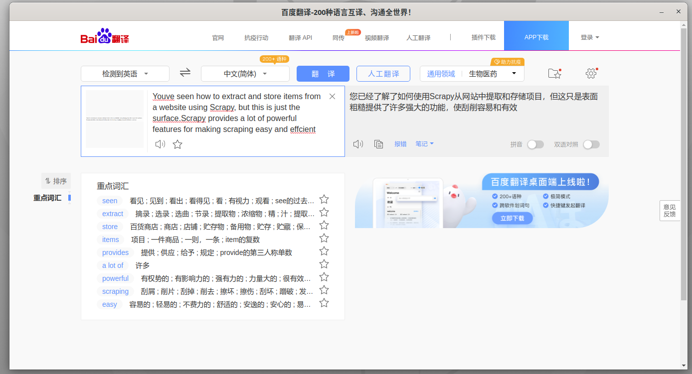
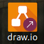
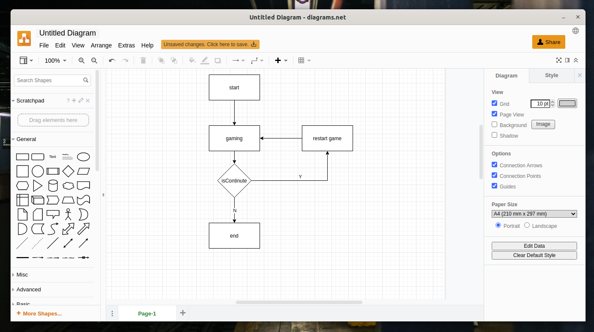
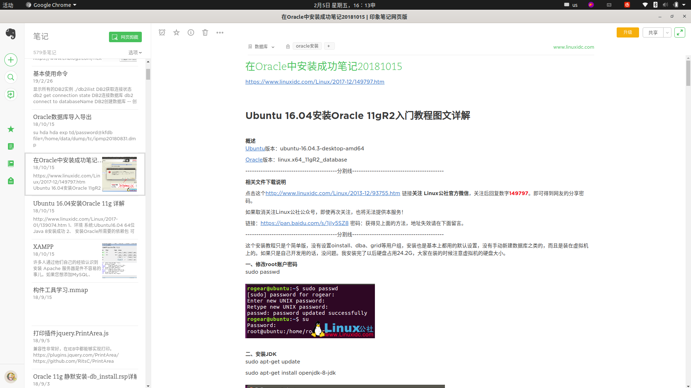

# web浏览器应用盒子

​	electron-webbox的作用就是将现成的网页应用通过这个软件包包装成类似桌面端的应用。

## **使用方式：**

```bash
electron-webbox --args url="https://www.processon.com/view/5f713035637689435ff04a39?fromnew=1" maximize icon=icon.png
```

## **应用参数：**

maximize 最大化窗口
file 从html文件载入
url 从一个URL地址载入
hideMenu 是否隐藏菜单(默认显示)

width Integer (可选) - 窗口的宽度(以像素为宽度)。 默认值为 800
height Integer (可选) - 窗口的高度(以像素为单位)。 默认值为 600
x Interger (可选) - (必选 如果使用了y) 窗口相对于屏幕左侧的偏移量。 默认值为将窗口居中。
y Integer (可选) - (必选 如果使用了x) 窗口相对于屏幕顶端的偏移量。 默认值为将窗口居中。
useContentSize Boolean (可选) - width 和 height 将设置为 web 页面的尺寸(译注: 不包含边框), 这意味着窗口的实际尺寸将包括窗口边框的大小，稍微会大一点。 默认值为 false.
center Boolean (可选) - 窗口在屏幕居中.
整型（可选）-窗口的最小宽度。默认为0 默认值为 0
minHeight Integer (optional) - Window's minimum height. 默认值为 0
maxWidth Integer(可选)-窗口的最大宽度。 默认值不限
maxHeight Integer (optional) - Window's maximum height. 默认值不限
resizable Boolean (optional) - Whether window is resizable. 默认值为 true。
movable Boolean (optional) - Whether window is movable. This is not implemented on Linux. 默认值为 true。
minimizable Boolean (optional) - Whether window is minimizable. This is not implemented on Linux. 默认值为 true。
maximizable Boolean (optional) - Whether window is maximizable. This is not implemented on Linux. 默认值为 true。
closable Boolean (optional) - Whether window is closable. This is not implemented on Linux. 默认值为 true。
focusable Boolean (可选) - 窗口是否可以聚焦. 默认值为 true。 在 Windows 中设置 focusable: false 也意味着设置了skipTaskbar: true. 在 Linux 中设置 focusable: false 时窗口停止与 wm 交互, 并且窗口将始终置顶。
alwaysOnTop Boolean (optional) - Whether the window should always stay on top of other windows. 默认值为 false.
fullscreen Boolean (可选) - 窗口是否全屏. 当明确设置为 false 时，在 macOS 上全屏的按钮将被隐藏或禁用. 默认值为 false.
fullscreenable Boolean (可选) - 窗口是否可以进入全屏状态. 在 macOS上, 最大化/缩放按钮是否可用 默认值为 true。
simpleFullscreen Boolean (optional) - Use pre-Lion fullscreen on macOS. 默认值为 false.
skipTaskbar Boolean (optional) - Whether to show the window in taskbar. Default is false.
kiosk Boolean (optional) - Whether the window is in kiosk mode. 默认值为 false.
titleString(可选) - 默认窗口标题 默认为"Electron"。 如果由loadURL()加载的HTML文件中含有标签<title>，此属性将被忽略。
icon (NativeImage | String) (可选) - 窗口的图标. 在 Windows 上推荐使用 ICO 图标来获得最佳的视觉效果, 默认使用可执行文件的图标.
show Boolean (optional) - Whether window should be shown when created. 默认值为 true。
paintWhenInitiallyHiddenBoolean(可选) - 当show为false并且渲染器刚刚被创建时，它是否应激活。 为了让document.visibilityState 在show: false的情况下第一次加载时正确地工作，你应该把这个设置成false. 设置为 false 将会导致ready-to-show 事件不触发。 默认值为 true。
frame Boolean (optional) - Specify false to create a Frameless Window. 默认值为 true。
parent BrowserWindow (optional) - Specify parent window. Default is null.
modal Boolean (optional) - Whether this is a modal window. This only works when the window is a child window. 默认值为 false.
acceptFirstMouse Boolean (optional) - Whether the web view accepts a single mouse-down event that simultaneously activates the window. Default is false.
disableAutoHideCursor Boolean (optional) - Whether to hide cursor when typing. 默认值为 false.
autoHideMenuBar Boolean (optional) - Auto hide the menu bar unless the Alt key is pressed. 默认值为 false.
enableLargerThanScreen Boolean (可选) - 是否允许改变窗口的大小使之大于屏幕的尺寸. 仅适用于 macOS，因为其它操作系统默认允许 大于屏幕的窗口。 默认值为 false.
backgroundColor String(可选) - 窗口的背景颜色为十六进制值，例如#66CD00, #FFF, #80FFFFFF (设置transparent为true方可支持alpha属性，格式为#AARRGGBB)。 默认值为 #FFF（白色）。
hasShadow Boolean (可选) - 窗口是否有阴影. 默认值为 true。
opacity Number (可选)-设置窗口初始的不透明度, 介于 0.0 (完全透明) 和 1.0 (完全不透明) 之间。 目前仅支持Windows 和 macos
darkTheme Boolean (optional) - 强制窗口使用深色主题，只在部分GTK+3桌面环境下有效。 默认值为 false.
transparent Boolean (optional) - Makes the window transparent. 默认值为 false. On Windows, does not work unless the window is frameless.
type String (可选) - 窗口的类型, 默认为普通窗口. 更多信息见下文
visualEffectState String (optional) - Specify how the material appearance should reflect window activity state on macOS. Must be used with the vibrancy property. 可能的值有
followWindow - The backdrop should automatically appear active when the window is active, and inactive when it is not. This is the default.
active - The backdrop should always appear active.
inactive - The backdrop should always appear inactive.
titleBarStyle String (optional) - The style of window title bar. Default is default. 可能的值有
	default - 标准灰色不透明的Mac标题栏
	hidden - 隐藏标题栏, 内容充满整个窗口, 但它依然在左上角, 仍然受标准窗口控制.
	hiddenInset - 隐藏标题栏, 显示小的控制按钮在窗口边缘
customButtonsOnHover Boolean (可选) - 在macOS的无框窗口上绘制自定义的关闭与最小化按钮. 除非鼠标悬停到窗口的左上角, 否则这些按钮不会显示出来. 这些自定义的按钮能防止, 与发生于标准的窗口工具栏按钮处的鼠标事件相关的问题. 注意: 此选项目前是实验性的。


## ubuntu制作web应用

### 百度翻译

```properties
[Desktop Entry]
Version=1.0
Type=Application
Name=百度翻译
Icon=/home/tc/.local/share/applications/baiduTranslate-icon.ico
Exec=electron-webbox --args url="https://fanyi.baidu.com/" width=1360 height=700 resizable=false maximizable=false icon=/home/tc/.local/share/applications/baiduTranslate-icon.ico
Comment=百度翻译;baidufanyi;baidu translate;translate;fanyi;
Categories=web tools
Terminal=false
```




### draw.io

​	提示:  这个软件官网有客户端发行版，[地址入口](https://github.com/jgraph/drawio-desktop/releases/tag/v14.1.8)。

```properties
[Desktop Entry]
Version=1.0
Type=Application
Name=draw.io
Icon=/home/tc/.local/share/applications/drawio-icon.ico
Exec=electron-webbox --args url=https://app.diagrams.net/ maximize icon=/home/tc/.local/share/applications/drawio-icon.ico
Comment=draw.io；uml;paint
Categories=web tools
Terminal=false
```






## **扩展：**

1.  使用google浏览器来完成类似的功能

   针对这个问题，可以使用这种方式来使用

   ```bash
which google-chrome-stable
   # /usr/bin/google-chrome-stable
   # 安装google浏览器后
   google-chrome-stable --help
   
   # 针对这个问题，可以使用这种方式来使用
   google-chrome-stable --app=https://app.yinxiang.com/Login.action
   ```
   
2. electron-webbox的作用就是将现成的网页应用通过这个软件包包装成类似桌面端的应用，然后在ubuntu中我可以通过ubuntu desktop发布成一个个Ubuntu应用程序。

   /home/tc/.local/share/applications/yinxiangNote.desktop

   或/usr/share/applications/yinxiangNote.desktop

```properties
[Desktop Entry]
Version=1.0
Type=Application
Name=印象笔记
Icon=/home/tc/.local/share/applications/yinxiangNote-icon.png
Exec=google-chrome-stable --app='https://app.yinxiang.com/Login.action'
Comment=ying xiang note;yingxiangnote;印象笔记
Categories=web tools
Terminal=false

```


